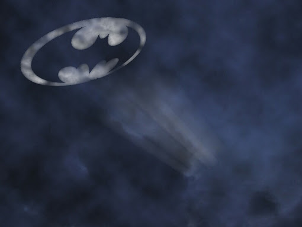

### Identity

-----------------------------

Blablabla

### Projects

-----------------------------

> #### Projects created during the **[Pop-Machina Academy](https://pop-machina.eu/academy)**
> 
> - Project 1
> - Project 2
>

### Contact

-----------------------------

To reach out to Metta-Machina, you can use the old fashion project light

or simply complete the contact form below:
<!DOCTYPE html>
<head>
    <meta charset="utf-8">
    <meta name="viewport" content="width=device-width, initial-scale=1, shrink-to-fit=no">
    <title>contact form</title>
</head>

<body>

<link href="contact-form.css" rel="stylesheet">

    

    <h3 class="fcf-h3">Contact us</h3>

    <form id="fcf-form-id" class="fcf-form-class" method="post" action="contact-form-process.php">
        
        

            <label for="Name" class="fcf-label">Your name</label>
            

                <input type="text" id="Name" name="Name" class="fcf-form-control" required>
            

        

        

            <label for="Email" class="fcf-label">Your email address</label>
            

                <input type="email" id="Email" name="Email" class="fcf-form-control" required>
            

        

        

            <label for="Message" class="fcf-label">Your message</label>
            

                <textarea id="Message" name="Message" class="fcf-form-control" rows="6" maxlength="3000" required></textarea>
            

        

        

            <button type="submit" id="fcf-button" class="fcf-btn fcf-btn-primary fcf-btn-lg fcf-btn-block">Send Message</button>
        

        

            <a href="https://www.freecontactform.com/form-guides/html-email-form" target="_blank">HTML Email Form</a> from FreeContactForm.com
        

    </form>
    

</body>
</html>

-----------------------------

-----------------------------

###### <em>**[Pop-Machina](https://pop-machina.eu/)** is a Horizon 2020 project that seeks to highlight and reinforce the links between the maker movement and circular economy in order to promote environmental sustainability and generate socio-economic benefits in European cities.This project has received funding from the European Union’s Horizon 2020 Research and Innovation Programme under grant agreement No 821479”. Disclaimer notice - The contents of this website reflect the view of the one of the Maker Champion. The views expressed in the website do not necessarily reflect the views of the Pop-Machina consortium neither to Euorpean Commision.</em>
