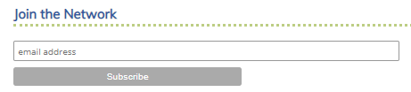
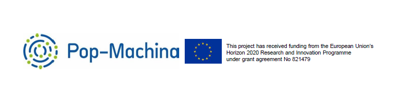

      

        

          

            <h4 class="m-0">Metta-Machina Home Page</h4>
            
Maker Champion Leuven #5

          

        

      

      <ul class="nav flex-column bg-white mb-0">
        <li class="nav-item">
          <a href="### Identity" class="nav-link text-dark font-italic bg-light">
            <i class="fa fa-th-large mr-3 text-primary fa-fw"></i> Identity
          </a>
        </li>
        <li class="nav-item">
          <a href="### Projects" class="nav-link text-dark font-italic">
            <i class="fa fa-address-card mr-3 text-primary fa-fw"></i> Projects
          </a>
        </li>
	 <li class="nav-item">
          <a href="### Pop-Machina related publications" class="nav-link text-dark font-italic">
            <i class="fa fa-address-card mr-3 text-primary fa-fw"></i> Pop-Machina related publications
          </a>
        </li>
	       <li class="nav-item">
          <a href="### Contact" class="nav-link text-dark font-italic">
            <i class="fa fa-address-card mr-3 text-primary fa-fw"></i> Contact
          </a>
        </li>
      </ul>
    

    
### Identity
-----------------------------

<iframe src="https://www.facebook.com/plugins/video.php?href=https%3A%2F%2Fwww.facebook.com%2Fwu.sfo%2Fvideos%2F554757271899292%2F&show_text=0&width=560" width="560" height="315" style="border:none;overflow:hidden" scrolling="no" frameborder="0" allowTransparency="true" allowFullScreen="true"></iframe>

### Projects
-----------------------------

> #### Projects created during the **[Pop-Machina Academy](https://pop-machina.eu/academy)**
> 
> - Project 00: Document what you have learnt from the Pop-Machina Academy Edition 2020 *[More information here](docPMA2020.md)* 
> - Project 1: Design your own website *[More information here](https://julie-pm.github.io/Metta-Machina/)* 
> - Project 2: Design your own logo *[More information here](logodesign.md)*
> - Project 3: Create your own bioplastic *[More information here](bioplastic.md)* 
> - Project 4: Gather all the plastic "consumed" at home for a week *[More information here](plasticwaste.md)* 

> #### Projects created for the **[City of Leuven](https://pop-machina.eu/pilots/leuven)**
> 
> - Project 1 (Coming soon)
> - Project 2 (Coming soon)
>

> #### Other projects available on my **[professional website](https://juliemetta.net/)**
> 

### Pop-Machina related publications
-----------------------------
- Pop-Machina: The breakthrough of the circular maker movement in Europe” (with K. Bachus), 2020, OpenAccessGovernment ISSN 2516-3817 April 2020 (p450-451). [(Available online)](https://www.openaccessgovernment.org/pop-machina-circular-maker-movement-in-europe/84803/)  
- Mapping the circular maker movement: from a literature review to a circular maker passport (with K. Bachus), 2020, Leuven: Pop-Machina project 821479 – H2020 (Deliverable 2.1) . [(Available online)](https://pop-machina.eu/resources/downloads/D2.1) 

### Contact
-----------------------------
#### Reach Metta-Machina

To reach out to Metta-Machina, you can click on the old fashion project light
 
 
or simply complete the contact form below:

<head>
    <meta charset="utf-8">
    <meta name="viewport" content="width=device-width, initial-scale=1, shrink-to-fit=no">
    <title>contact form</title>
</head>
<body>	
	

    

    <h5 class="fcf-h3">Form to contact Metta-Machina</h5>
<form
  action="https://formspree.io/mjvaryer"
  method="POST"
>
<li>   <label for="Name" class="fcf-label"> Your Name <input type="text" name="name">  </label> </li>  
 <li>   <label for="Email" class="fcf-label"> Your Email <input type="email" name="_replyto">  </label> </li>  
 <li>   <label for="Message" class="fcf-label">Your Message <textarea name="message"></textarea>  </label> </li>  
 <li>   <input type="submit" value="Send"> </li>  
</form>
    

    </body>
    
#### Join the **[Pop-Machina](https://pop-machina.eu/)** Network of Interest
The so-called Pop-Machina Network of Interest aims to be such a positive community of change. It aspires to connect people from all over Europe and beyond to one another, keep them informed of innovations that hold a great potential to change our production and consumption patterns for the better as well as provide citizens with a platform where they can voice their opinions and ideas as well. At its core, Pop-Machina Network of Interest brings together all the enthusiasts that want to follow the progress of the project, stay up to date with the related topics and trends more broadly and contribute to the discussions on the various issues related to the maker movement and circular economy, including on the challenges and opportunities of circular maker communities.

Sign up to [Pop-Machina Network of Interest](https://pop-machina.eu/Network-of-Interest) to:
- receive a biannual newsletter with many interesting news on Pop-Machina and more;
- connect with likeminded individuals and organisations;
- participate in discussions on the various issues related to the maker movement and circular economy, including on the challenges that maker communities face and how to best overcome them;
- participate in the learning workshop (will be organised later on in the project).

<em>Click to the image below to send an email</em>

 
 
-----------------------------
-----------------------------
 

###### <em>**[Pop-Machina](https://pop-machina.eu/)** is a Horizon 2020 project that seeks to highlight and reinforce the links between the maker movement and circular economy in order to promote environmental sustainability and generate socio-economic benefits in European cities. This project has received funding from the European Union’s Horizon 2020 Research and Innovation Programme under grant agreement No 821479”.</em>
###### <em> Disclaimer notice - The contents of this website reflect the view of the one of the Maker Champion. The views expressed in the website do not necessarily reflect the views of the Pop-Machina consortium neither to European Commission.</em>
