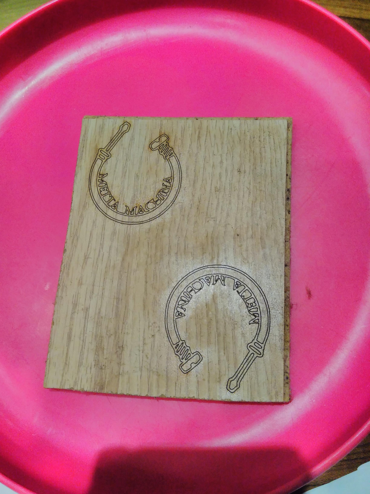
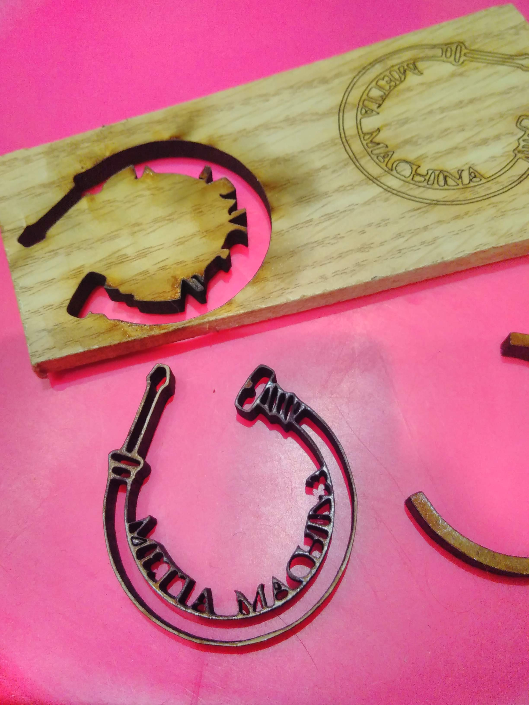
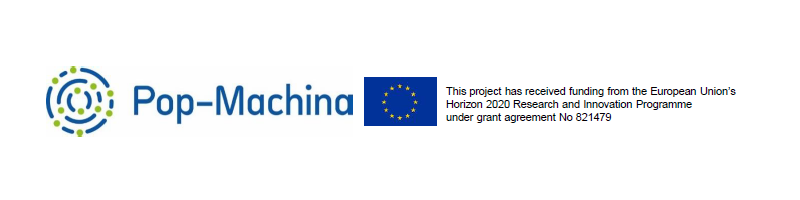

      

        

          

            <h4 class="m-0">Project 2 : Logo Design</h4>
          

        

      

      <ul class="nav flex-column bg-white mb-0">
     <li class="nav-item">
          <a href="### Descriptif" class="nav-link text-dark font-italic bg-light">
            <i class="fa fa-th-large mr-3 text-primary fa-fw"></i> Descriptif
          </a>
        </li>
     <li class="nav-item">
          <a href="### Steps" class="nav-link text-dark font-italic">
            <i class="fa fa-address-card mr-3 text-primary fa-fw"></i> Steps
          </a>
        </li>
	 <li class="nav-item">
          <a href="### Results" class="nav-link text-dark font-italic">
            <i class="fa fa-address-card mr-3 text-primary fa-fw"></i> Results
          </a>
        </li>
	   <li class="nav-item">
          <a href="### Join the **[Pop-Machina](https://pop-machina.eu/)** Network of Interest" class="nav-link text-dark font-italic">
            <i class="fa fa-address-card mr-3 text-primary fa-fw"></i> Join Pop-Machina
          </a>
        </li>
           <li class="nav-item">
          <a href="index.md" class="nav-link text-dark font-italic">
            <i class="fa fa-address-card mr-3 text-primary fa-fw"></i> Go back to Home page
          </a>
        </li>
      </ul>
    

    
### Descriptif
-----------------------------

For this second project, a logo had to be designed, laser cut, conceptualized in 3D modeling and modelled.
Here you find the most achieved version of the Metta-Machina logo (can also be used as a small version of a prject light ^^)

### Steps
-----------------------------

> #### Step 1 - Create the Metta-Machina Logo

> ##### In Power Point
The Logo was firstly design using the software "power point". The software was used due to is friendly userness and the non-need for previous background/knowledge.
It took me about 30min to design the logo. 
First, I choosed a picture of a screw and of a screw driver from internet. 
Second, I copied pasted them in the powerpoint application and deleted the parts I didn't want. 
Third, I created a circular band to join the two tools. 
Fourth, I added the "Metta-Machina" text (using the circular option). 
Last but not least, I choose to colore all parts of my logo in black. 
The logo was saved as .jpg. 

  
Here the logo of Metta-Machina - which can also be used to create a light projector 

> ##### In Inkscape
Now that the logo is created, it needs to be in a compatible format to be laser cut.
I used the free software Inkscape to convert my logo into a lasercut comptatible format (.dxf).
I choose Inkscape because this software is free, handy, and tutorials can easily be found online. 
To convert my file I used [this tutorial](https://www.youtube.com/watch?v=mYkLix7UT44).  
An important step (not explained in this tutorial) is to be sure that the part you want to laser cut are in the good color. With the laser cut I used, the part to be cut had to be in full red. 
I also had to remove the dash as it will be lost during the laser cutting.

You can download the [.dxf file](https://julie-pm.github.io/Metta-Machina/metta-machina.dxf) to lasercut the Metta-Machina logo. 

> ##### In SketchUp
Now that the logo is in 2D it has to be converted in a 3D compatible format.
I used SkechUp to do so, as I add previous knowledge on this software. SketchUp is a free tool which also provide the possibility to work online (so no need to download any program).  
Once the .dxf file imported to SketchUp, you have to firstly make the imported file as a surface, then to delete the part that should not be 3D printed (the holes) and finally to extrude the surface you want as 3D. The file is then ready to be 3D printed.  You can also use one of the availale tutorial such as [this tutorial](https://www.youtube.com/watch?v=0JSkczTHAh8)

  
Here the 3D logo of Metta-Machina with different views

You can download the [.stl file](https://julie-pm.github.io/Metta-Machina/mettamachina3D.stl) to 3D print the Metta-Machina logo. 

> #### Step 2 - Laser cut the logo

> ##### In Wood
I used piece of wood found in a trash. I guess it is leftover from a woodenfloor.  
The first 3 trials failed as the wood composition wasn't known. I tried with different settings of the machine and dfferent width for the wood but the laser cutter wouldn't go through the whole piece of wood. **It is very important to know what is the composition of your material to be able to laser cut properly.**

  
Here above picture of 2 of 3 the failing attempts.

>I discovered that one side of the material was softer than the other and that the laser could go easily trhough it (way easier than from the other side).
Finally I found a setting that could cut trhough the wood entirely. However you can notice some burned marks. The settings were not ideal for this kind of wood (But I had no sample left.) 
Once cut, I figured out that the lower part of the logo was to thin and such very fragile. You can also notice that few letters didn't make it through as there were too thin and broke during the process.

  
Hare above the picture of the "finally" cut logo (left) and of another failing attempt (right).

> ##### In Plastic
I wanted to use plastic from my collection of "consumed plastic" (see [Project 4](plasticwaste.md)), however, all trials spectaculary failed. All the plastic tested burnt and the process had to be interupt before its full completion. 
The reasons for the failures are the same as above. The exact composition of the plastic was not found or not macthing with the available settings of the machine. Knowing the exact composition of the material to be laser cut is key to properly achieve a laser cutting. 

  
Here above picture of the "plastic" failing attempts.

> #### Step 3 - 3D print the logo
> To be coming soon

### Results (Tadam!)
-----------------------------
> #### Laser cut the logo
> ##### In Wood

  
Here the logo of Metta-Machina laser cut in wood (see the shadow!)

> ##### In Plastic

  
Here the logo of Metta-Machina laser cut in plexi (see the nice shadow!)

> #### 3D print the logo
To be coming soon

#### Join the **[Pop-Machina](https://pop-machina.eu/)** Network of Interest
The so-called Pop-Machina Network of Interest aims to be such a positive community of change. It aspires to connect people from all over Europe and beyond to one another, keep them informed of innovations that hold a great potential to change our production and consumption patterns for the better as well as provide citizens with a platform where they can voice their opinions and ideas as well. At its core, Pop-Machina Network of Interest brings together all the enthusiasts that want to follow the progress of the project, stay up to date with the related topics and trends more broadly and contribute to the discussions on the various issues related to the maker movement and circular economy, including on the challenges and opportunities of circular maker communities.

Sign up to [Pop-Machina Network of Interest](https://pop-machina.eu/Network-of-Interest) to:
- receive a biannual newsletter with many interesting news on Pop-Machina and more;
- connect with likeminded individuals and organisations;
- participate in discussions on the various issues related to the maker movement and circular economy, including on the challenges that maker communities face and how to best overcome them;
- participate in the learning workshop (will be organised later on in the project).

<em>Click to the image below to send an email</em>

 
 
-----------------------------
-----------------------------
 

###### <em>**[Pop-Machina](https://pop-machina.eu/)** is a Horizon 2020 project that seeks to highlight and reinforce the links between the maker movement and circular economy in order to promote environmental sustainability and generate socio-economic benefits in European cities. This project has received funding from the European Union’s Horizon 2020 Research and Innovation Programme under grant agreement No 821479”.</em>
###### <em> Disclaimer notice - The contents of this website reflect the view of the one of the Maker Champion. The views expressed in the website do not necessarily reflect the views of the Pop-Machina consortium neither to European Commission.</em>
