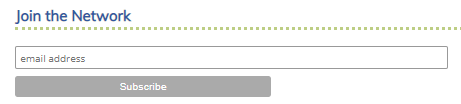

      

        

          

            <h4 class="m-0">Project 4 : Plastic Waste</h4>
          

        

      

      <ul class="nav flex-column bg-white mb-0">
     <li class="nav-item">
          <a href="### Descriptif" class="nav-link text-dark font-italic bg-light">
            <i class="fa fa-th-large mr-3 text-primary fa-fw"></i> Descriptif
          </a>
        </li>
	 <li class="nav-item">
          <a href="### Results" class="nav-link text-dark font-italic">
            <i class="fa fa-address-card mr-3 text-primary fa-fw"></i> Results
          </a>
        </li>
	   <li class="nav-item">
          <a href="### Join the **[Pop-Machina](https://pop-machina.eu/)** Network of Interest" class="nav-link text-dark font-italic">
            <i class="fa fa-address-card mr-3 text-primary fa-fw"></i> Join Pop-Machina
          </a>
        </li>
           <li class="nav-item">
          <a href="index.md" class="nav-link text-dark font-italic">
            <i class="fa fa-address-card mr-3 text-primary fa-fw"></i> Go back to Home page
          </a>
        </li>
      </ul>
    

    
### Descriptif
-----------------------------

For this fourth project, plastic waste "consumed" in my household was collected during a week.  
The Household is living in house with a small garden in Leuven, Belgium, and is constitute of 2 adults:  
- a 30+ Swiss man unemployed (looking for a job opportunity in Belgium related to IT/Project management - we never know who read this website :-) ) 
- a 20+ French woman employed as PhD candidate and 4.xx month pregnant during the experiment 
- a Hong Kong cat (short hair) with half a tail  
The household is vegetarian (except for the cat), but cheese eaters (except for the cat)  

A picture of the above-mentioned cat (named Pussy) in her favorite position (walking on the wall - everybody has a special skill) 

### Results (Tadam!)
-----------------------------
> #### Laser cut the logo

  

#### Join the **[Pop-Machina](https://pop-machina.eu/)** Network of Interest
The so-called Pop-Machina Network of Interest aims to be such a positive community of change. It aspires to connect people from all over Europe and beyond to one another, keep them informed of innovations that hold a great potential to change our production and consumption patterns for the better as well as provide citizens with a platform where they can voice their opinions and ideas as well. At its core, Pop-Machina Network of Interest brings together all the enthusiasts that want to follow the progress of the project, stay up to date with the related topics and trends more broadly and contribute to the discussions on the various issues related to the maker movement and circular economy, including on the challenges and opportunities of circular maker communities.

Sign up to [Pop-Machina Network of Interest](https://pop-machina.eu/Network-of-Interest) to:
- receive a biannual newsletter with many interesting news on Pop-Machina and more;
- connect with likeminded individuals and organisations;
- participate in discussions on the various issues related to the maker movement and circular economy, including on the challenges that maker communities face and how to best overcome them;
- participate in the learning workshop (will be organised later on in the project).

<em>Click to the image below to send an email</em>

 
 
-----------------------------
-----------------------------
 

###### <em>**[Pop-Machina](https://pop-machina.eu/)** is a Horizon 2020 project that seeks to highlight and reinforce the links between the maker movement and circular economy in order to promote environmental sustainability and generate socio-economic benefits in European cities. This project has received funding from the European Union’s Horizon 2020 Research and Innovation Programme under grant agreement No 821479”.</em>
###### <em> Disclaimer notice - The contents of this website reflect the view of the one of the Maker Champion. The views expressed in the website do not necessarily reflect the views of the Pop-Machina consortium neither to European Commission.</em>
